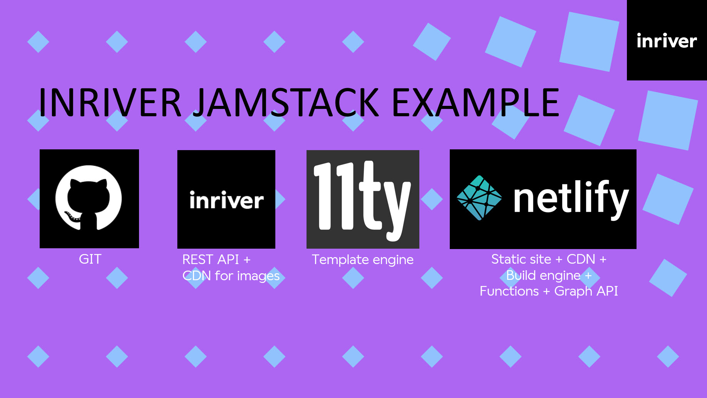
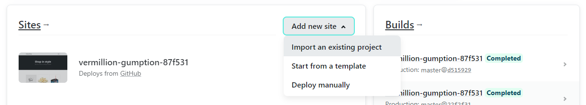
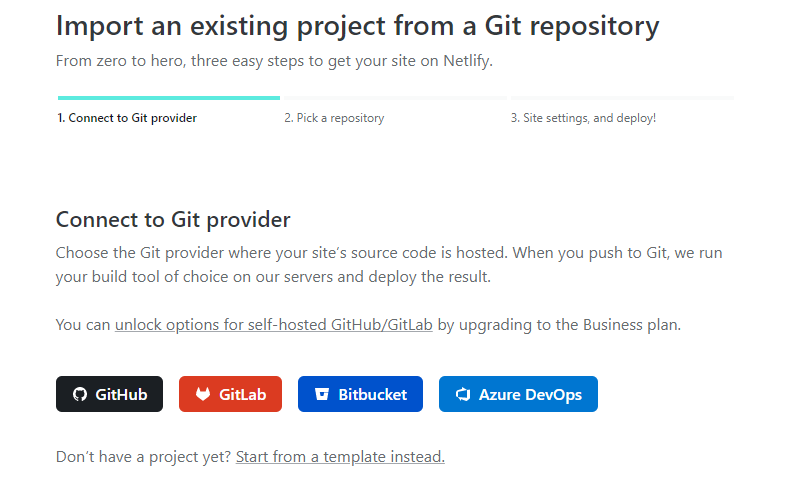
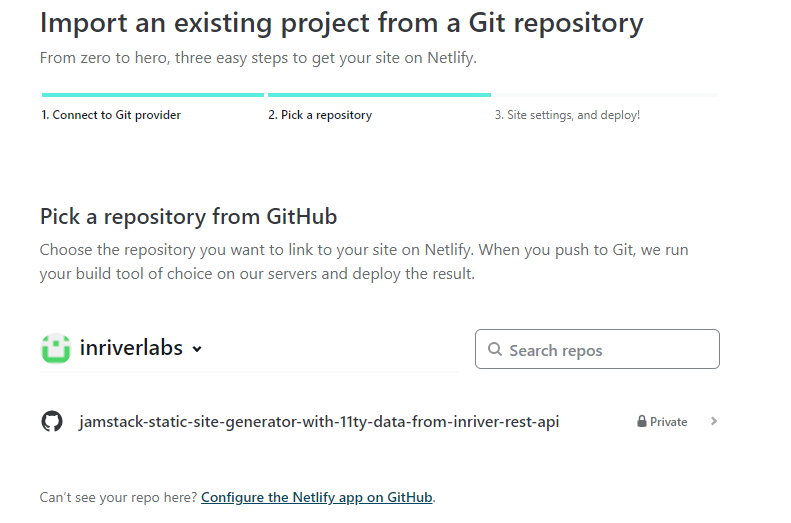
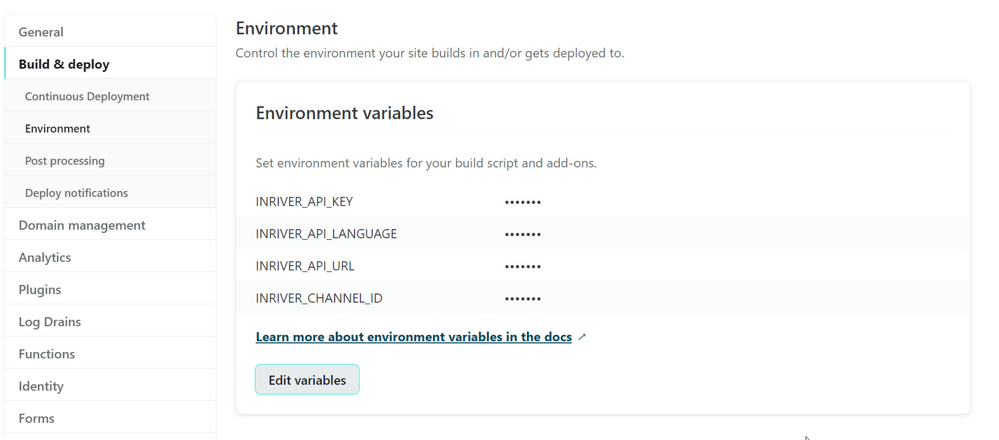
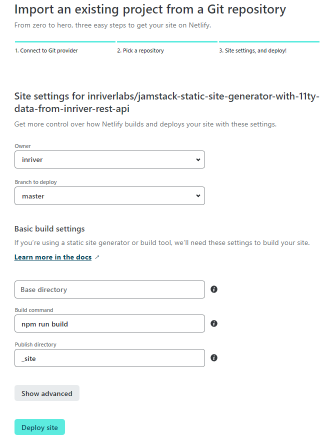

# JAMSTACK Static site generator with 11ty from inriver REST API

## Install locally
```
npm install --save-dev @11ty/eleventy
npm upgrade
```

## Add .env file to root folder
```
INRIVER_API_LANGUAGE=en
INRIVER_API_KEY=*************************************
INRIVER_API_URL=https://api-partner1a-euw.productmarketingcloud.com
INRIVER_CHANNEL_ID=1772
```

* These are the settings that will be used to fecth Product data from a specific channel in inriver. 

## Build all pages
```
npx @11ty/eleventy
```

## More commands can be found here
[https://www.11ty.dev/docs/usage/](https://www.11ty.dev/docs/usage/)


## GOAL with this inriver innovation labs project. 

1. Showcase how [inriver PIM](https://www.inriver.com/) REST API data can generate static websites super easy and fast. 
2. Showcase how GITHUB changes on your templates code can regenerate the JAMSTACK site and atomic deploy to Netlify
3. Showcase how Netlify can be triggered to fetch data from inriver REST API and regenerate a JAMSTACK site  https://www.netlify.com/products/build/
5. Showcase how inriver CDN feature for images can be used to deliver optimized images for websites and e-commerce.
7. Add an .env file to show how many different sites can be generated quickly by a setting
8. Showcase how inriver settings for REST API can be saved as Netlify Environment variables (same as .env)
9. Showcase how you can templates with your own brand identity by generating your own static web sites with 11ty / eleventy. 
10. Showcase how the static site generated by inriver JSON data and REST API can be extended to use other APIS in a simple way to get additional data that can be included to the website. https://www.netlify.com/blog/announcing-netlify-graph-a-faster-way-for-teams-to-develop-web-apps-with-apis/


## Deploy to Github and trigger deploy on netlify
https://dev.to/michaelburrows/deploy-a-static-eleventy-11ty-site-from-github-to-netlify-57ho

<hr>

## Getting Started

To get started, below are the following steps we did to develop this project.

* Clone this repo to your local computer and your own Github.
* Initialize your project directory as a node project with `npm init -y`
* Install the @11ty/eleventy and axios package with node package manager.
```
npm install --save-dev @11ty/eleventy
npm install axios
```
* Update the `package.json` file to your own github location.
```
{
  "name": "jamstack-static-site-generator-with-11ty-data-from-inriver-rest-api",
  "version": "1.0.0",
  "description": "## Install locally ``` npm install --save-dev @11ty/eleventy npm upgrade ```",
  "main": "index.js",
  "scripts": {
    "start": "npx eleventy --serve",
    "build": "eleventy"
  },
  "repository": {
    "type": "git",
    "url": "git+https://github.com/inriverlabs/jamstack-static-site-generator-with-11ty-data-from-inriver-rest-api.git"
  },
  "keywords": [],
  "author": "",
  "license": "ISC",
  "bugs": {
    "url": "https://github.com/inriverlabs/jamstack-static-site-generator-with-11ty-data-from-inriver-rest-api/issues"
  },
  "homepage": "https://github.com/inriverlabs/jamstack-static-site-generator-with-11ty-data-from-inriver-rest-api#readme",
  "devDependencies": {
    "@11ty/eleventy": "^1.0.1"
  },
  "dependencies": {
    "@supercharge/promise-pool": "^2.2.0",
    "axios": "^0.27.2",
    "dotenv": "^16.0.1"
  }
}
```
* The eleventy config file `(.eleventy.js)` in the project root directory has the following config settings:
```js

module.exports = function(eleventyConfig) {

    eleventyConfig.addPassthroughCopy("./src/css/"); // passthrough so 11ty can include the css file in build time
    eleventyConfig.addWatchTarget("./src/css/"); // dev purpose, so that when we do changes to the file, it will trigger page reload

    return {
        dir: {
            input: 'src',              // indicates where our source code and files are located
            inlcludes: '_includes',    // all templating files in this dir will be included by 11ty (default include directory)
            output: '_site',           // public directory, this is where the static pages will be generated and stored (default public directory)
        },
        templateFormats: ['md', 'njk', 'html'],
        markdownTemplateEngine: 'njk',
        htmlTemplateEngine: 'njk',
        dataTemplateEngine: 'njk',
    }
}

```
* The `src` directory. This directort contains the source code to connect to inriver REST API and templates that 11ty will use to build the static pages.

* Inside the `src` directory, create two sub directories, `_data` - contain the js scripts to fetch data from inriver REST API so we can dynamically rendering our templates, and `_includes` - where we store some of our template file(s). 

```js
// sample js data file
const axios = require("axios");

module.exports = async () => {
    const result = await axios({
        method: 'GET',
        url: 'https://api-partner1a-euw.productmarketingcloud.com/api/v1.0.0/channels',
        headers: {
            'Accept': 'application/json',
            'X-inRiver-APIKey': 'XXXXXXXXXXXXX'
        }
    });
    
    return result.data
}
```
> In our `_data` directory, we used axios and PromisePool to fetch product information from inriver REST API. The file name of our js data file will also be the variable name when we access its data in our templating engine (in our case nunjucks)<br><br>
Inside the `_includes` directory, we store our **base template** inside the `layouts` sub directory.

* Template files are placed inside our `src` directory. We have two template files, `index.njk` and `products.njk`. Refer to the links below for the 11ty tutorials.
```html
<!--- Sample accessing data from our page template --->

   <div class="col mb-5">
      <div class="card h-100">
            <!-- Product image-->
            
            <!-- Product details-->
            <div class="card-body p-4">
               <div class="text-center">
                  <!-- Product name-->
                  <h5 class="fw-bolder">{{ product.summary.displayDescription }}</h5>
                  <!-- Product SKU-->
                  SKU: {{ product.summary.displayName }}-{{ product.summary.id }}
               </div>
            </div>
            <!-- Product actions-->
            <div class="card-footer p-4 pt-0 border-top-0 bg-transparent">
               <div class="text-center"><a class="btn btn-outline-dark mt-auto" href="/product/{{ product.summary.displayName }}/index.html">View Product</a></div>
            </div>
      </div>
   </div>

```
- [11ty Official Page](https://www.11ty.dev/)
- [11ty rocks](https://11ty.rocks/)
- [Turn static HTML/CSS into a blog with CMS using the JAMStack](https://www.youtube.com/watch?v=4wD00RT6d-g&list=PLNwlBMq98qvvC2asTNxTDBXVrECDnCnQL&index=45&t=3977s&ab_channel=KevinPowell)

## Deploying 11ty to Netlify

- Create an account with [Netlify](https://www.netlify.com/).
- In home page, import existing project from Git to Netlify.

- Connect your Git account to Netlify. Follow authentication and authorization steps.

- Select Git project repository to deploy.

- Configure site setting variables.


- Configure site settings and deploy.



After completing this deployment wizard, Netlify will start configuring your site, build the static site pages and deploy your site while fecting product information data from inriver PIM.